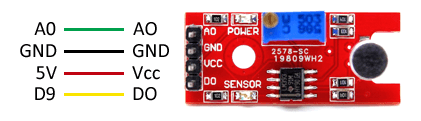
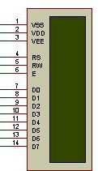
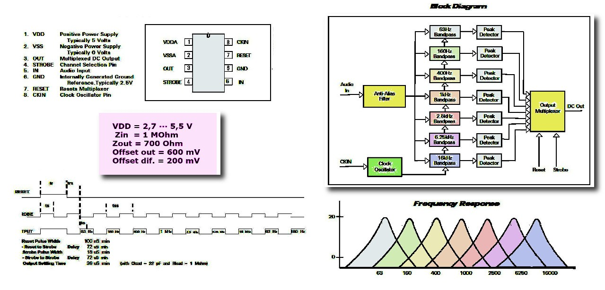

# Audio-Spectrum-Analyzer

## Materials

* [X] Arduino UNO
* [ ] MSGEQ7
* [X] Sound sensor
* [X] Resistors
* * [X] 200kΩ
* * [X] 22kΩ
* [X] Condensers
* * [X] 33µF
* * [X] 0.1µF (x3)
* [X] LCD display
* [ ] Amplifier

## Description

This project consists in an audio spectrum analizer. 
A microphone will take data for a while, then the data obtained will be read by a python program. Finally usin the matplotlib libray we will get the spectrogram of the audio recorded.

## Circuits

The sound sensor, the LCD display and the MSGEQ7 are the most important components of the circuit.

### sound sensor
The analogic output of this sensor lets us obtain a estimate the volume registered.
This type of modules with microphone aren't adecuate to measure the sound in a analogic way, they lack of amplification. We'll use KY-038 for this project.

### LCD diplay
It converts electric signals into visual information for the human eye.
In this case the LCD has 2 rows of 16 characters.

To be able to control the LCD only using two pins of the arduino board, we'll use an adapter module from LCD to I2C.

### MSGQ7
This chip is a seven band graph ecualyzer, it is a CMOS chip that divides the espectre of audio in seven bands (63Hz, 160Hz, 400Hz, 1kHz, 2.5KHz, 6.25KHz, 16KHz).
The seven frecuences are detected and multiplexed in the output.

## Dependencies

All the dependescies used in this projects have been installed with pip3.

  * [ ] matplotlib
